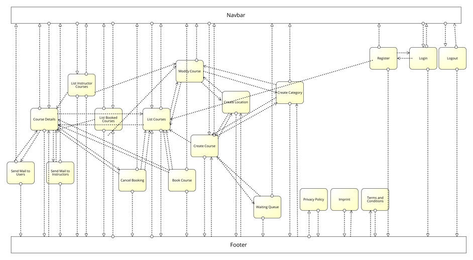

# MyUSI
## Introduction
MyUSI is a web application for viewing, booking and creating courses. The target audience is made up of general users and course instructors, trying to advertise and book each other’s services.
Therefore, the application has a clear design and layout, as well as being easily accessible and visually appealing. User data is carefully collected and processed and is only displayed in anonymously. This is only done, if a benefit for the user is visible.

## Team members
### Development Team
 - Reiter Christian
 - Roth Matthias
 - Till Tristan
 - Windisch Matthias

### Design Team
- Reiter Christian
- Roth Matthias
- Till Tristan
- Windisch Matthias

### Management
- Reiter Christian
- Roth Matthias
- Till Tristan
- Windisch Matthias

# Software Architecture
The software architecture of the web application is based on spring. The database is built on an external MariaDB database, implemented into the web application on Spring Boot. Each page is represented by a JSP file. Entities and Repositories are programmed in Kotlin. Additionally, CSS files are used for further design and JavaScript for code.

# Libraries/Features
The libraries and features used, apart from those proposed in the lectures and exercises:

 - Google Maps API for visually displaying the lcoation at which a course will be occuring
 - Google Charts for helping a course instructor understand his audiences preferences
 - Google Mail Service for easily sending emails to users to provide confirmation for their actions taken on the web page

# Application Usage
## User Management
### Unauthenticated User
Can browse and select courses in the database. Additionally, authorized to register, login and logout.

### Authenticated User
Can access the same functionality as the unauthenticated user. Additionally, authorized to book courses, and subsequently cancel the registration. All booked courses are visible in a separate page. Can send emails to all instructors.
Users can be registered; therefore, you can create your own user. Alternatively, you can log in with the following credentials:

Username: thomas

Password: password

### Course Instructor
Can access the same functionality as the authenticated user. Additionally, can create courses, categories and locations, as well as modify courses previously created and all locations. Authorized to view all his proposed courses in a separate page. Can send emails to all users registered in a specific.
Course instructors cannot be registered. Therefore, a course instructor can be logged in with the following credentials:

Username: ingrid 

Password: password

### Administrator
Can access the same functionality as the administrator. Additionally, can modify all courses.
Course instructors cannot be registered. Therefore, a course instructor can be logged in with the following credentials:

Username: demoadmin 

Password: yN4YBkRk6fXkP9YD

## Link to full documentation
OneDrive:
https://fhjoanneum-my.sharepoint.com/:w:/g/personal/matthias_windisch_edu_fh-joanneum_at/ESDdEnsN2IlPqf77rfdNWRMBWYTruPHZWoVfpb9uhi7xGw?e=A7iI4F
